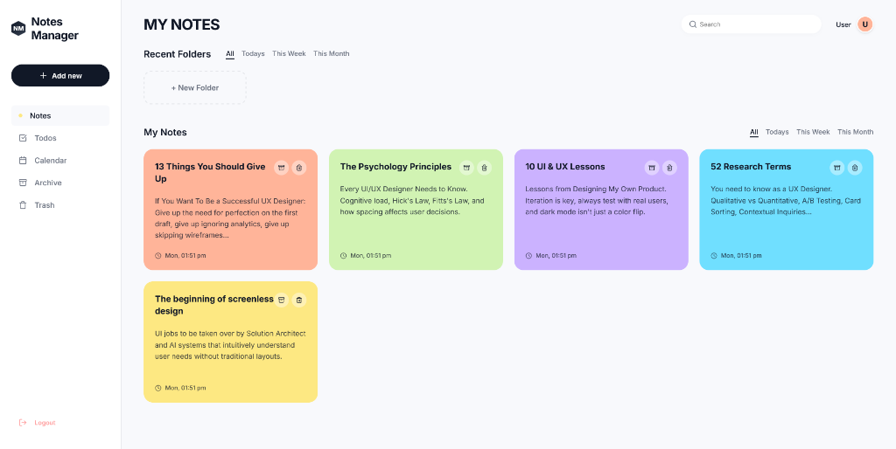
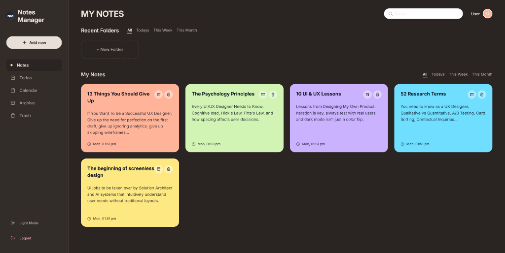
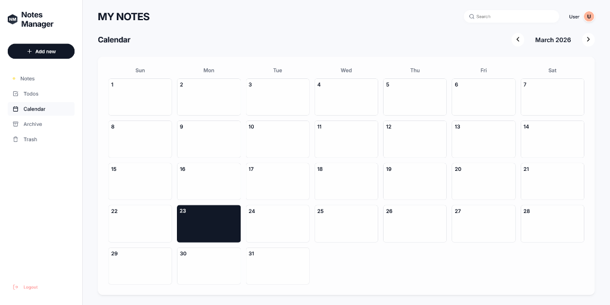
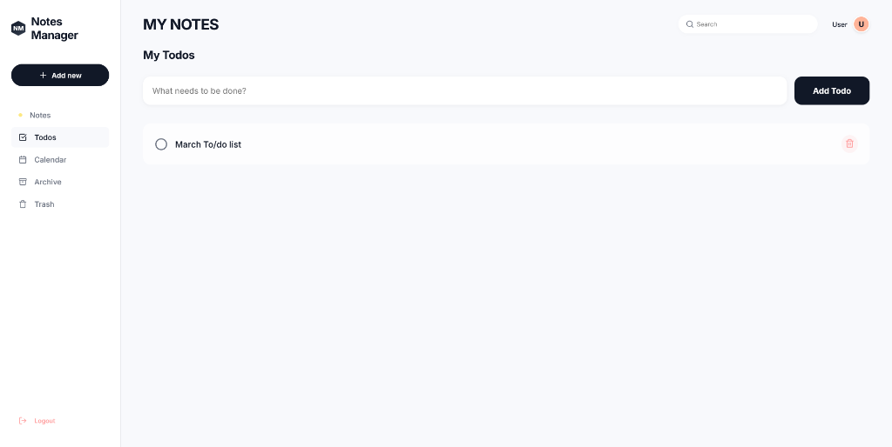

# Notes Manager 📝

A beautifully crafted, feature-rich Notes Management application built on the MERN stack. Designed with modern aesthetics in mind, this app features glassmorphism effects, a curated pastel color palette, smooth micro-animations, and a completely customized "warm chocolate" dark mode.

## 📸 Screenshots






## 🌟 Key Features

- **Dynamic Authentication**: Full JWT-based login and signup system that greets you by your name.
- **Pastel Note Cards**: Create, edit, and pin notes wrapped in beautiful pastel colors.
- **Granular Organization**:
  - Automatically sort and filter notes by *Today*, *This Week*, or *This Month*.
  - Create custom colored **Folders** to group related ideas.
- **Comprehensive Dashboards**:
  - **Todos**: An interactive checklist for daily tasks.
  - **Archive**: Easily hide away older notes.
  - **Trash**: Soft-delete notes allowing for quick restoration.
  - **Calendar**: A fully functional, interactive calendar to view and assign real-time events.
- **Premium Aesthetics**:
  - Custom geometric logo branding.
  - Pixel-perfect typography using the `Inter` font.
  - A luxurious, toggleable **Dark Mode** featuring a warm taupe & chocolate palette for perfect low-light contrast that makes the pastel notes pop.

## 🛠️ Tech Stack

- **Frontend**: React (Vite), React Router, Axios, Lucide React (Icons)
- **Backend**: Node.js, Express.js
- **Database**: MongoDB (Mongoose)
- **Styling**: Custom Vanilla CSS (CSS Variables, Flexbox/Grid, Glassmorphism)

## 🚀 Running Locally

Follow these steps to run the application on your local machine:

### Prerequisites
- [Node.js](https://nodejs.org/) installed
- [MongoDB](https://www.mongodb.com/) running locally (defaulting to port `27017`)

### 1. Setup the Backend
Open your terminal and navigate to the backend directory:
```bash
cd backend
npm install
```

Ensure you have a `.env` file in the `/backend` folder with the following variables:
```env
PORT=5000
MONGO_URI=mongodb://127.0.0.1:27017/notes-manager
JWT_SECRET=supersecretjwtkey_notes_manager_123
```

Start the backend server (using nodemon for hot-reloading):
```bash
npx nodemon server.js
```

### 2. Setup the Frontend
Open a new terminal window and navigate to the frontend directory:
```bash
cd frontend
npm install
```

Start the Vite development server:
```bash
npm run dev
```

### 3. Usage
- The backend API will be running on `http://localhost:5000`.
- The frontend will be accessible at `http://localhost:5173`.
- Open `http://localhost:5173` in your browser, click **Sign up** to create an account, and experience Notes Manager firsthand!

---
*Built with precision and an emphasis on pixel-perfect User Experience.*
